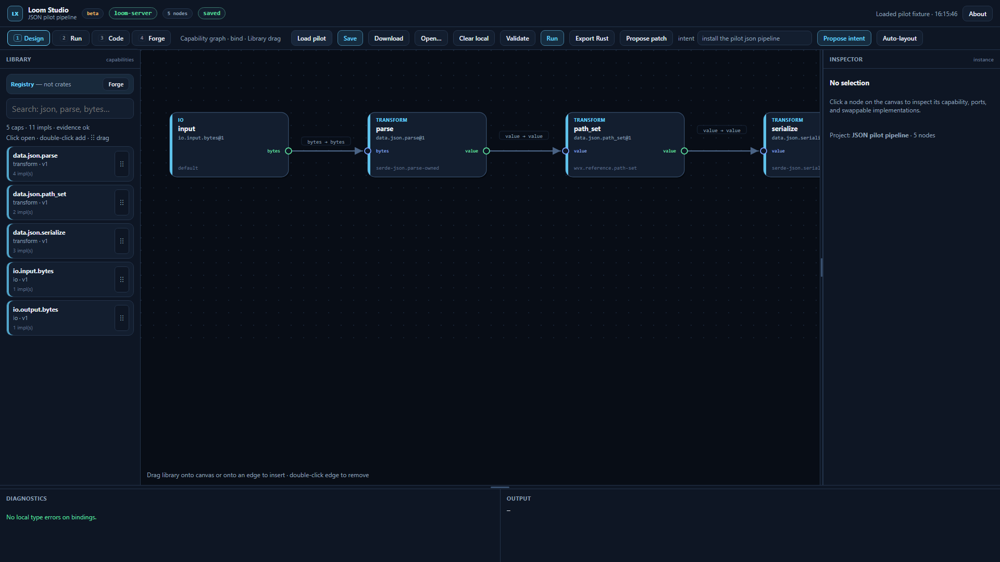
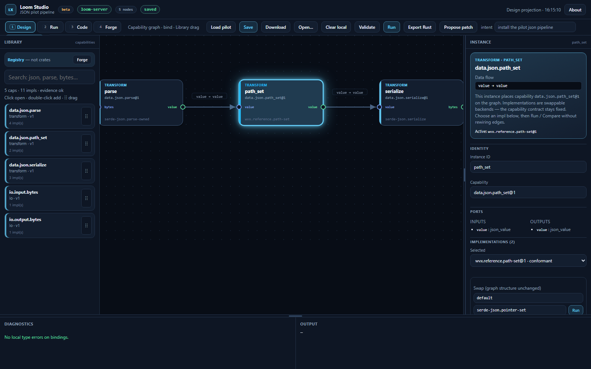
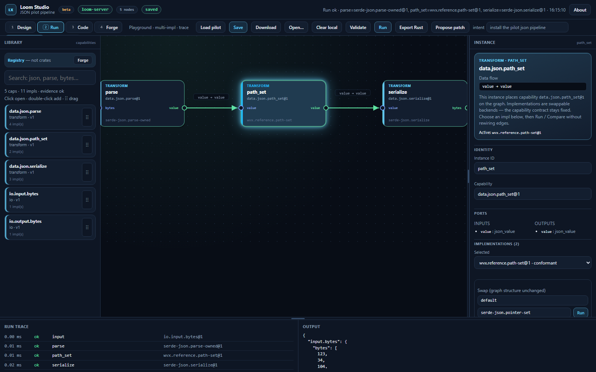
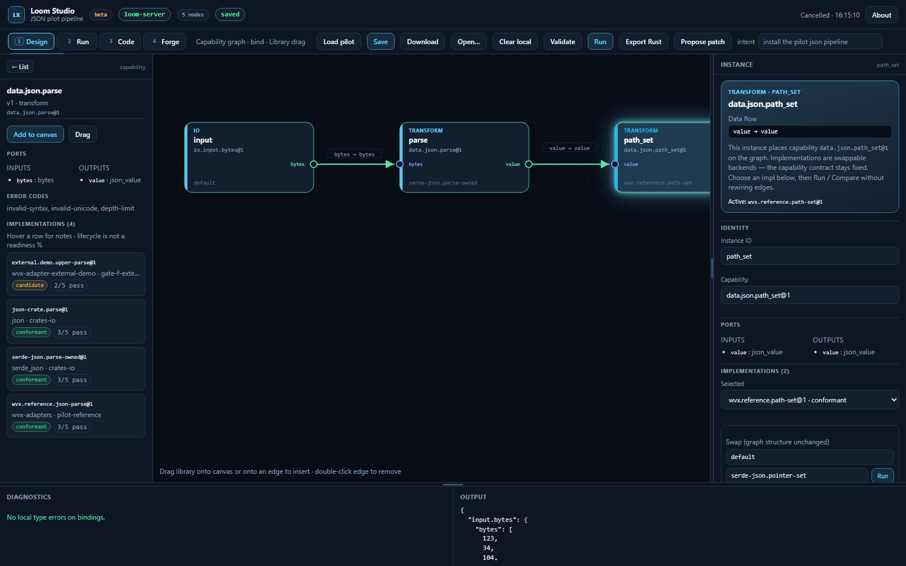
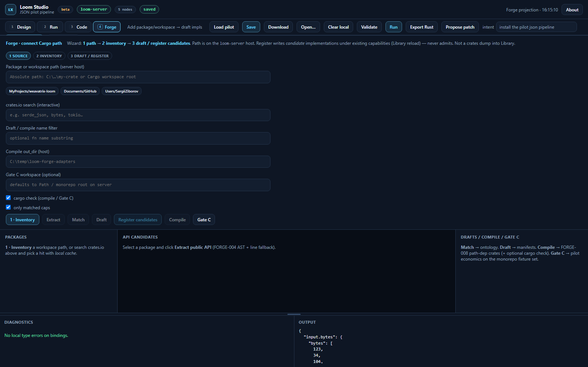
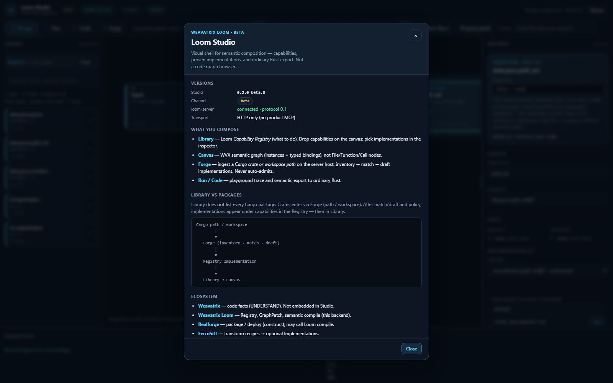

# Weavatrix Loom

**Compose systems from verified capabilities. Get ordinary Rust.**

Weavatrix Loom is **semantic software composition** — not a repository indexer
and not a second Weavatrix code graph.

| This product **owns** | This product **does not own** |
| --- | --- |
| Capability · Implementation · Instance · Binding | Deep AST / symbol / call / import graph |
| **Registry** (interchange + multi-fact evidence + resolve) | Generic deploy / multi-package scaffolding |
| GraphPatch · validator · playground | Agent token economy / model routing |
| **Semantic compiler** → ordinary Rust | Deterministic transform-ops *runtime* (see FerroSift) |
| Thin **Forge** = semantic ingestion / classification | “Code intelligence” product positioning |

Full boundaries: **[ADR-0012](docs/adr/0012-ecosystem-boundaries.md)** ·
**[ecosystem distribution](docs/ecosystem-distribution.md)**.

## Place in the ecosystem

```text
                         AI
                          │
              ┌───────────┴───────────┐
              │                       │
          Cortex                 GrantTap / …
       token economy             agent control
              │
              ▼
       ┌───────────────┐
       │   Weavatrix   │  UNDERSTAND — “what exists in code?”
       │ Code facts    │
       └───────┬───────┘
               │ facts (target: feed Forge)
               ▼
       ┌───────────────┐
       │ Weavatrix Loom│  SEMANTIC — “what does it mean / proven / compose?”
       │ Registry +    │  ← YOU ARE HERE
       │ Compiler +    │
       │ thin Forge    │
       └───────┬───────┘
               │ capability graph / resolved export
               ▼
       ┌───────────────┐
       │   Realforge   │  CONSTRUCT — “how do we get a shippable artifact?”
       └───────────────┘

FerroSift (transform recipes / ops runtime)
    → may back Loom Implementations after conformance
    → is NOT a rival capability Registry
```

| Product | Repo | Role |
| --- | --- | --- |
| **Weavatrix** | [weavatrix](https://github.com/sergii-ziborov/weavatrix) | Code intelligence (index, symbols, impact, search) |
| **Weavatrix Loom** | **this repo** | Capability registry, composition, proof, semantic compile |
| **Loom Studio** | [loom-studio](https://github.com/sergii-ziborov/loom-studio) | Visual shell over Loom (no second backend) |
| **Realforge** | construct product (TBD) | Scaffold / package / deploy; *may call* Loom compiler |
| **FerroSift** | [ferrosift](https://github.com/sergii-ziborov/ferrosift) | Deterministic transform recipes/ops (Wasm-capable) |
| **Cortex Loom** | [cortex-loom](https://github.com/sergii-ziborov/cortex-loom) | Agent process / context; thin bridge: `wvx-cortex` |

**Naming:** in architecture text use **Weavatrix Loom**. “Loom” alone never means
Weavatrix or Cortex Loom. **Loom Forge** ≠ Realforge.

### Loom core pipeline (unique)

```text
Capability → Implementations → Conformance → Evidence → Resolution → Compile → Rust
```

Forge target shape (not a code graph product):

```text
Weavatrix facts → Loom Forge (classify / match) → Registry draft
```

Local Cargo/AST inventory in `wvx-forge` is **bootstrap only** until Weavatrix
feeds signatures/spans (ADR-0012).

> **Status:** **v0.2 beta** — multi-domain pilots (JSON · text · hash · compress · codec),
> **M1 Truthful Registry**, **M2 Safe Semantic Core**, **EvidenceArtifact v0.2**,
> unified **promote** transaction, `compile_release` + `VerifiedImplementation`.  
> Not a hosted marketplace. Details:
> **[docs/beta-prototype.md](docs/beta-prototype.md)** ·
> **[docs/truthful-registry.md](docs/truthful-registry.md)** ·
> **[docs/domain-roadmap.md](docs/domain-roadmap.md)**. UI:
> **[loom-studio](https://github.com/sergii-ziborov/loom-studio)**.

## Studio preview (v0.2 beta)

UI: **[loom-studio](https://github.com/sergii-ziborov/loom-studio)** — HTTP only to
`loom-server`. Screenshots below are from the live JSON pilot (same assets as Studio
repo `docs/images/`).

### Design — Library + WVX semantic canvas



*Capability **Library** (Registry, not crates) · typed bindings · inspector.
Not a Weavatrix File/Call code graph.*

### Inspector + Run

| Inspector (swap impls) | Run (trace + output) |
| --- | --- |
|  |  |

### Library detail · Forge · About

| Capability page | Forge path ingest | About |
| --- | --- | --- |
|  |  |  |

*Forge: package/workspace path on the server host → inventory → match → draft /
register **candidates** (never auto-admit). About: product boundaries + HTTP-only.*

## Why

The next abstraction is not prettier blocks or more LLM code generation. It
appears when four things are true at once:

1. **Capability is separate from implementation**
2. **Implementations are swappable** without rewriting the semantic graph
3. **Compatibility and behavior are checked**, not only documented
4. **Humans and AI edit the same structural model** (not free-form file edits)

Weavatrix answers *what is in the repository*. Loom answers *what it means as a
composable, proven capability system* and *how to emit ordinary Rust*.

## Core ideas

| Concept | Meaning |
| --- | --- |
| **Capability** | What must be done (stable contract, ports, errors) |
| **Implementation** | Which Rust code fulfills that contract |
| **Instance** | A capability placed in a project with config |
| **Binding** | A validated connection between typed ports |
| **Evidence** | Multi-fact trust axes (build, conformance, bench, license, security) — never a single % |
| **Registry** | Interchangeable implementations + lifecycle + resolution (**Loom-owned**) |
| **GraphPatch** | Authoritative semantic edit ops |
| **WVX** | Project / IR format (`.wvx`) |

Boundary types in `0.1` are owned and canonical (`string`, `bytes`,
`json.value`, lists, options, records, …). Upstream crates may use any Rust
types internally; adapters normalize them at the component boundary.

## Schemas & decisions

| Path | What |
| --- | --- |
| [`schemas/`](schemas/) | JSON Schema for project, capability, GraphPatch, **evidence v0.1/v0.2** |
| [`docs/adr/`](docs/adr/) | ADRs — especially **[0012 ecosystem boundaries](docs/adr/0012-ecosystem-boundaries.md)** |
| [`docs/ecosystem-distribution.md`](docs/ecosystem-distribution.md) | Ownership matrix (Weavatrix / Loom / Realforge / FerroSift / Cortex) |
| [`docs/truthful-registry.md`](docs/truthful-registry.md) | M1 truthful rules + EvidenceArtifact v0.2 + promote |
| [`docs/domain-roadmap.md`](docs/domain-roadmap.md) | Domains 1–4 (no Domain 5 until trust closure) |
| [`docs/go-no-go-a-d-pilot-json.md`](docs/go-no-go-a-d-pilot-json.md) | Gate A/D evidence on the JSON pilot |
| [`docs/go-no-go-e-pilot.md`](docs/go-no-go-e-pilot.md) | Gate E pilot (registry trust lab) |
| [`docs/go-no-go-f-pilot.md`](docs/go-no-go-f-pilot.md) | Gate F pilot (SDK extensibility) |
| [`docs/go-no-go-c-pilot.md`](docs/go-no-go-c-pilot.md) | Gate C pilot (Forge economics harness) |

Rust IR types remain authoritative if schema and code diverge.

## Workspace

This repository is a **Rust library platform** plus thin hosts. **Library crates**
are on **crates.io** (`wvx-types`, `wvx-command-bus`, …) and remain
path-consumable from this monorepo. Hosts (`loom-server`, `wvx-cli`, `wvx-mcp`)
are not published. See **[docs/crate-surface.md](docs/crate-surface.md)**.

The visual Studio UI lives in a separate repository and talks **HTTP only** to
`loom-server` — **not** MCP. `wvx-mcp` is an **optional agent adapter** over the
same command bus (for coding agents), never a Studio or Realforge dependency.
Weavatrix MCP is a separate agent tool for code facts; Loom products do not
embed it.

| Crate | Role |
| --- | --- |
| `wvx-types` | Canonical boundary types (**lib**) |
| `wvx-ir` | WVX entities (capability, implementation, instance, binding, project) (**lib**) |
| `wvx-project-graph` | Project graph operations + GraphPatch apply (**lib**) |
| `wvx-validator` | M2 validation passes (schema, cycles, cardinality, policy, …) (**lib**) |
| `wvx-runtime` | Dynamic playground execution (erased values) (**lib**) |
| `wvx-compiler-rust` | Export to Rust + `CompilePolicy` / **`compile_release`** (**lib**) |
| `wvx-registry-client` | Registry + **EvidenceArtifact v0.2** + **promote** + resolve (**lib**) |
| `wvx-command-bus` | Shared semantic API for **CLI + HTTP** (**lib**; preferred host entry) |
| `wvx-cli` | Command-line entry point (**product host**) |
| `wvx-mcp` | Optional **agent-only** MCP adapter (`mcport`) — not used by Studio |
| `wvx-adapters` | Pilot adapters: JSON · text · hash · compress · **codec** (**lib**) |
| `wvx-component-sdk` | Gate F adapter ABI (plugin register + emit templates) (**lib**) |
| `wvx-adapter-external-demo` | External fixture (`upper_parse`) — demo only |
| `wvx-forge` | Thin Forge: bootstrap inventory + **semantic match/draft** (**lib**; deep code facts → Weavatrix; ADR-0012) |
| `wvx-conformance` | Pilot + **profile-driven** suites + multi-domain golden (**lib**) |
| `wvx-cortex` | Intent → GraphPatch (heuristics + optional xAI LLM; ops only) (**lib** bridge) |
| `loom-server` | Local HTTP API for Studio (`127.0.0.1:43917`) (**product host**) |

## CI

GitHub Actions (`.github/workflows/ci.yml`) on push/PR to `main`:

1. `cargo check --workspace` + `cargo test --workspace`
2. **Gates A/D:** `wvx conformance` + `cargo test -p wvx-conformance` (includes golden export)
3. Smoke run with `json-crate.parse@1`
4. Presence checks for schemas / ADRs / pilot fixture

## Quick start (alpha)

**Full local alpha (API + Studio):**

```powershell
# Terminal A
cd weavatrix-loom
powershell -File ./scripts/dev-server.ps1

# Terminal B
cd loom-studio
npm install
npm run dev
# http://127.0.0.1:5173  — HTTP only (no MCP)
```

**Smoke without the browser:**

```powershell
cd weavatrix-loom
powershell -File ./scripts/alpha-smoke.ps1
```

**CLI only:**

```bash
cargo check --workspace
cargo run -p wvx-cli -- --help
```

Validate and run pilot fixtures (multi-domain):

```bash
cargo run -p wvx-cli -- validate fixtures/pilot-json-pipeline.wvx.json
cargo run -p wvx-cli -- run fixtures/pilot-json-pipeline.wvx.json
cargo run -p wvx-cli -- run fixtures/pilot-hash-pipeline.wvx.json --input-json "hello"
# codec: write bytes to a file then --input path
cargo run -p wvx-cli -- run fixtures/pilot-codec-roundtrip.wvx.json --input ./hello.txt
cargo run -p wvx-cli -- implementations
```

Swap an implementation **without** changing the capability graph or bindings:

```bash
# default: serde-json parse + serialize
cargo run -p wvx-cli -- run fixtures/pilot-json-pipeline.wvx.json

# alternate parse (lite recursive-descent) + pretty serialize
cargo run -p wvx-cli -- run fixtures/pilot-json-pipeline.wvx.json \
  --impl parse=wvx.reference.json-parse@1 \
  --impl serialize=wvx.reference.json-serialize-pretty@1

# third parse backend (json crate)
cargo run -p wvx-cli -- run fixtures/pilot-json-pipeline.wvx.json \
  --impl parse=json-crate.parse@1

# path_set via JSON Pointer (swap without rewiring bindings)
cargo run -p wvx-cli -- run fixtures/pilot-json-pipeline.wvx.json \
  --impl path_set=serde-json.pointer-set@1
```

`run` uses built-in pilot playground handlers. Trace lines report which
implementation executed per instance.

Export a native Rust package (adapters inlined, `cargo check` / run):

```bash
cargo run -p wvx-cli -- export-rust fixtures/pilot-json-pipeline.wvx.json \
  -o /tmp/loom-export --check --run

# Release policy (digests; optional Cargo.lock generation)
cargo run -p wvx-cli -- export-rust fixtures/pilot-json-pipeline.wvx.json \
  -o /tmp/loom-export-rel --check --release
```

The export is a normal Cargo package with `run_pipeline(&[u8]) -> Result<Vec<u8>, String>`  
(raw stdout bytes — works for JSON **and** binary digests).  
API **`compile_release`** requires a `VerifiedImplementation` pool (not raw manifests).

## Domains (pilots)

| Domain | Family | Fixtures |
| --- | --- | --- |
| 1 JSON | `data.json.*` | `pilot-json-pipeline.wvx.json` |
| 2 Hash | `data.hash.*` | `pilot-hash-pipeline.wvx.json` |
| 3 Compress | `data.compress.*` | `pilot-compress-pipeline.wvx.json` |
| 4 Codec | `data.codec.*` | `pilot-codec-*.wvx.json` |
| text | `data.text.*` | `pilot-text-pipeline.wvx.json` |

See [domain-roadmap](docs/domain-roadmap.md). **No Domain 5** until trust P1 completes.

## Local registry (`registry-dev`)

Pilot capability contracts and implementation manifests live in
[`registry-dev/`](registry-dev/). Query them with:

```bash
cargo run -p wvx-cli -- registry summary
cargo run -p wvx-cli -- registry search json
cargo run -p wvx-cli -- registry implementations --capability data.json.parse@1
cargo run -p wvx-cli -- registry inspect serde-json.parse-owned@1

# Lifecycle vs multi-fact evidence (overclaim = fail)
cargo run -p wvx-cli -- registry check
# Evidence artifacts required for conformant+
cargo run -p wvx-cli -- registry truthful
# EvidenceArtifact v0.2
cargo run -p wvx-cli -- registry mint-evidence serde-json.parse-owned@1 --profile json-rfc8259-core-v1
cargo run -p wvx-cli -- registry verify-evidence serde-json.parse-owned@1
# Unified promotion (build → suite → artifact → audit)
cargo run -p wvx-cli -- registry promote serde-json.parse-owned@1 --profile json-rfc8259-core-v1 --cases 8
```

Override the path with `--path` or `WVX_REGISTRY`.  
See [`docs/truthful-registry.md`](docs/truthful-registry.md) · [`docs/admission-pilot.md`](docs/admission-pilot.md).

## HTTP server

```bash
cargo run -p loom-server
# http://127.0.0.1:43917/health
# WVX_HTTP_ADDR=127.0.0.1:44000 WVX_REGISTRY=./registry-dev cargo run -p loom-server
```

| Method | Path | Notes |
| --- | --- | --- |
| GET | `/health` | liveness |
| GET | `/api/v1/protocol` | protocol version |
| POST | `/api/v1/project/validate` | body: `{ "project": … }` |
| POST | `/api/v1/project/run` | body: `{ "project", "input_json"?, "impls"? }` |
| POST | `/api/v1/project/export-rust` | in-memory generated package |
| GET | `/api/v1/registry/summary` | |
| GET | `/api/v1/registry/search?q=` | |
| GET | `/api/v1/registry/implementations?capability=` | |
| GET | `/api/v1/registry/inspect/{key}` | |
| GET | `/api/v1/registry/admission` | lifecycle vs evidence audit (overclaim) |
| POST | `/api/v1/graph/preview_patch` | ghost GraphPatch (no revision bump) |
| POST | `/api/v1/graph/commit_patch` | atomic commit (revision only if valid) |
| GET | `/api/v1/pilot/implementations` | playground handler catalog |
| POST | `/api/v1/forge/inventory` | bootstrap crate scan (not Weavatrix-grade index) |
| POST | `/api/v1/forge/extract` | bootstrap public-API candidates |
| POST | `/api/v1/forge/match` | map candidates → capability ontology (FORGE-007) |
| POST | `/api/v1/forge/draft` | adapter drafts (`inventory_only`) |
| POST | `/api/v1/forge/compile` | compileable semantic adapter pack (FORGE-008) |
| POST | `/api/v1/forge/gate-c` | Gate C pilot economics harness |
| POST | `/api/v1/graph/propose_patch` | body `{ project? }` — relative pilot GraphPatch |
| POST | `/api/v1/graph/propose_intent` | body `{ project, intent }` — heuristic or LLM (ops only) |
| POST | `/api/v1/graph/validate_patch` | ghost validate |
| POST | `/api/v1/graph/apply_patch` | authoritative commit (valid only) |

### Loom Forge (thin semantic ingestion)

**Not** a code-intelligence product. Target path (ADR-0012):

```text
Weavatrix (code facts) → Forge (match / draft) → Registry
```

**Preferred:** ingest a Weavatrix facts bundle (`wvx.facts.v0.1`). Local Cargo inventory/AST
extract remains **bootstrap** when facts are unavailable.

```bash
# Weavatrix facts → candidates → ontology match
cargo run -p wvx-cli -- forge facts fixtures/weavatrix-facts-sample.json
cargo run -p wvx-cli -- forge match --facts fixtures/weavatrix-facts-sample.json
cargo run -p wvx-cli -- forge draft --facts fixtures/weavatrix-facts-sample.json

# Bootstrap (offline AST) still works
cargo run -p wvx-cli -- forge inventory .
cargo run -p wvx-cli -- forge extract crates/wvx-adapters
cargo run -p wvx-cli -- forge match crates/wvx-adapters
cargo run -p wvx-cli -- forge export-facts crates/wvx-adapters -o /tmp/facts.json
cargo run -p wvx-cli -- forge draft crates/wvx-adapters --name parse -o /tmp/loom-drafts
cargo run -p wvx-cli -- forge compile crates/wvx-adapter-external-demo -o /tmp/fa --name upper --check
cargo run -p wvx-cli -- forge gate-c --workspace .
```

HTTP: `POST /api/v1/forge/facts`, and `match`/`draft` accept `facts` | `facts_json` | `facts_path`.

No `build.rs`, no network for inventory/extract. Drafts are **not** admitted.
Broad packaging/CI/deploy → **Realforge**; deep symbols/search → **Weavatrix**.

CORS is open for local Studio development. Bind stays loopback by default.

### External adapters

Pilot JSON implementations live in the **`wvx-adapters`** crate. Exports vendor
that crate under `vendor/wvx-adapters` so generated projects stay self-contained
while the monorepo keeps a single source of truth.

## Loom Studio (separate repo)

The visual editor lives in **[loom-studio](https://github.com/sergii-ziborov/loom-studio)**
(not this crate). Run the server here, then:

```bash
cd ../loom-studio
npm install
npm run dev
# http://127.0.0.1:5173  (Vite proxies /api and /health → loom-server)
```

## Conformance & golden

```bash
# Pilot JSON + multi-impl equality + profile-driven multi-domain suites
cargo run -p wvx-cli -- conformance

# Profile runner only (sha256 / hex / base64 / json profiles)
cargo run -p wvx-cli -- conformance --profiles
cargo run -p wvx-cli -- conformance --profile sha256-fips180-4-v1

# Dynamic playground ≡ static export (JSON combos + hash/codec/text)
cargo run -p wvx-cli -- conformance --golden

# Or as unit tests
cargo test -p wvx-conformance
```

### Maturity milestones

| Milestone | Doc | Status |
| --- | --- | --- |
| **M1** Truthful Registry | [truthful-registry.md](docs/truthful-registry.md) | **Landed** — artifacts, truthful CI |
| **M2** Safe Semantic Core | [beta-prototype.md](docs/beta-prototype.md) | **Landed** — validator passes, preview/commit, CompilePolicy |
| **Trust** Evidence v0.2 + promote | [truthful-registry.md](docs/truthful-registry.md) | **Landed** — mint/verify/promote, `compile_release` |
| **P1** Profile runner + multi-domain golden | this section | **In progress** |

Go/No-Go evidence:

| Gate | Doc | Pilot verdict |
| --- | --- | --- |
| **A** / **D** | [`docs/go-no-go-a-d-pilot-json.md`](docs/go-no-go-a-d-pilot-json.md) | **Go** transform interchange + dynamic≡static |
| **C** | [`docs/go-no-go-c-pilot.md`](docs/go-no-go-c-pilot.md) | **Go (external)** 6 pkgs · multi-domain · human-minutes |
| **E** | [`docs/go-no-go-e-pilot.md`](docs/go-no-go-e-pilot.md) | **Go (pilot lab)** bench + provenance + human admit / promote |
| **F** | [`docs/go-no-go-f-pilot.md`](docs/go-no-go-f-pilot.md) | **Go (pilot fixture)** SDK external adapter without pilot match arms |

```bash
cargo run -p wvx-cli -- bench -o .lab/bench.json
cargo run -p wvx-cli -- registry check
cargo run -p wvx-cli -- registry truthful
cargo run -p wvx-cli -- forge gate-c --external fixtures/gate-c-external --human-minutes 50 --check
```

### Intent → GraphPatch (thin Cortex bridge)

`wvx-cortex` only proposes **GraphPatch ops** (not a full Cortex Loom product).
Full agent workflow / token economy lives in **[cortex-loom](https://github.com/sergii-ziborov/cortex-loom)** (ADR-0012).

**Most of Loom works with zero cloud keys.** Run, validate, export, registry, Forge
match/draft, and rule-based / heuristic GraphPatch are fully offline.

Optional LLM propose (free-form English → ops-only GraphPatch) uses **xAI**
(SpaceXAI-compatible API) when the **server** has:

| Env | Required? | Purpose |
| --- | --- | --- |
| `XAI_API_KEY` | only for LLM intents | Server-side chat completions at `https://api.x.ai/v1` |
| `WVX_LLM_MODEL` | no (default model) | Override chat model |
| `XAI_BASE_URL` | no | Override API base |

Create a key at [console.x.ai](https://console.x.ai). **Never commit the key** and
**never put it in the Studio frontend** — only `loom-server` / CLI process env.

```bash
# Offline heuristics (no API key):
cargo run -p wvx-cli -- patch intent "install the pilot json pipeline"
cargo run -p wvx-cli -- patch intent "use pretty serialize" --project fixtures/pilot-json-pipeline.wvx.json
cargo run -p wvx-cli -- patch intent "switch parse to json-crate" --project fixtures/pilot-json-pipeline.wvx.json

# Optional LLM (Windows PowerShell example):
# $env:XAI_API_KEY = "xai-..."
# cargo run -p wvx-cli -- patch intent "add a pretty serialize step if missing" --project fixtures/pilot-json-pipeline.wvx.json
```

Studio: toolbar **intent** + **Propose intent** → Accept/Reject (ghost banner). Without
`XAI_API_KEY` on the server, known phrases still work via heuristics.

## Related repositories

| Repo | Role |
| --- | --- |
| **[weavatrix-loom](https://github.com/sergii-ziborov/weavatrix-loom)** (this) | Semantic composition platform (Registry, compiler, WVX) |
| **[loom-studio](https://github.com/sergii-ziborov/loom-studio)** | Studio UI over Loom |
| **[weavatrix](https://github.com/sergii-ziborov/weavatrix)** | Code intelligence — facts Loom should consume |
| **[weavatrix-graph](https://github.com/sergii-ziborov/weavatrix-graph)** | Deterministic code-graph core (Weavatrix) |
| **[ferrosift](https://github.com/sergii-ziborov/ferrosift)** | Transform recipe/ops runtime → optional Implementations |
| **[cortex-loom](https://github.com/sergii-ziborov/cortex-loom)** | Agent process / context (not Loom Registry) |
| **[mcport](https://crates.io/crates/mcport)** | MCP stdio runtime for `wvx-mcp` |

See also [ecosystem-distribution.md](docs/ecosystem-distribution.md).

## Pilot scope (`0.1` / beta)

Semantic domains in `registry-dev` (architecture freeze — grow domains, not IR):

**Domain 1 — JSON**

```text
Input Bytes → JSON Parse → JSON Path Set → JSON Serialize → Output Bytes
```

**Text family** (still Domain-adjacent transforms)

```text
Input Bytes → Text Uppercase → Text Lowercase → Output Bytes
```

**Domain 2 — Hashing** (Gate C multi-domain proof)

```text
Input Bytes → SHA-256 digest → Output Bytes
```

| Family | Capabilities | Multi-impl examples |
| --- | --- | --- |
| `data.json.*` | parse · path_set · serialize | serde-json / reference / json-crate |
| `data.text.*` | uppercase · lowercase | Unicode vs ASCII-only |
| `data.hash.*` | sha256 · blake3 | **4×** SHA-256 multi-impl + blake3 |
| `data.compress.*` | gzip · gunzip | **3×** each (flate2 path variants) |
| `io.*` | input.bytes · output.bytes | reference I/O |

Fixtures: `pilot-json`, `pilot-text`, `pilot-hash`, `pilot-compress`.  
Resolver: `wvx registry resolve <cap>` · Requal: `wvx registry requalify <impl>`.  
Roadmap: [docs/domain-roadmap.md](docs/domain-roadmap.md).

Goals:

- typed ports and validated bindings
- more than one implementation per capability (swap without rewiring)
- playground run with a trace
- export to a `cargo`-buildable workspace
- CLI and HTTP over one command bus (optional agent MCP adapter; no free-form AI file edits)

Out of scope for beta: multi-language implementations, required WASM, databases
and queues, distributed transactions, autonomous production swaps, hosted registry.

## Design principles

- **Rust is the production output.** Generated code should be readable and
  maintainable outside Loom.
- **One command bus.** Studio (HTTP), CLI, and optional agent MCP share the same operations; the UI is
  not a second backend.
- **Evidence is multi-fact.** Build, conformance, benchmarks, license, and
  advisories stay separate — there is no single “readiness 82%” score.
- **Fail closed on structure.** Bindings exist only after validation.
- **Transport-independent core.** Libraries do not depend on HTTP or the editor.
- **No dual code graph.** Deep repository intelligence is Weavatrix; Loom only
  references facts for semantic classification (ADR-0012).
- **Registry + compiler stay in Loom.** Realforge may *call* compile; it does not
  own WVX IR or admit policy.
- **AI suggestions are not evidence.** (ADR-0010)

## License

Licensed under either of

- Apache License, Version 2.0 ([LICENSE-APACHE](LICENSE-APACHE))
- MIT license ([LICENSE-MIT](LICENSE-MIT))

at your option.
