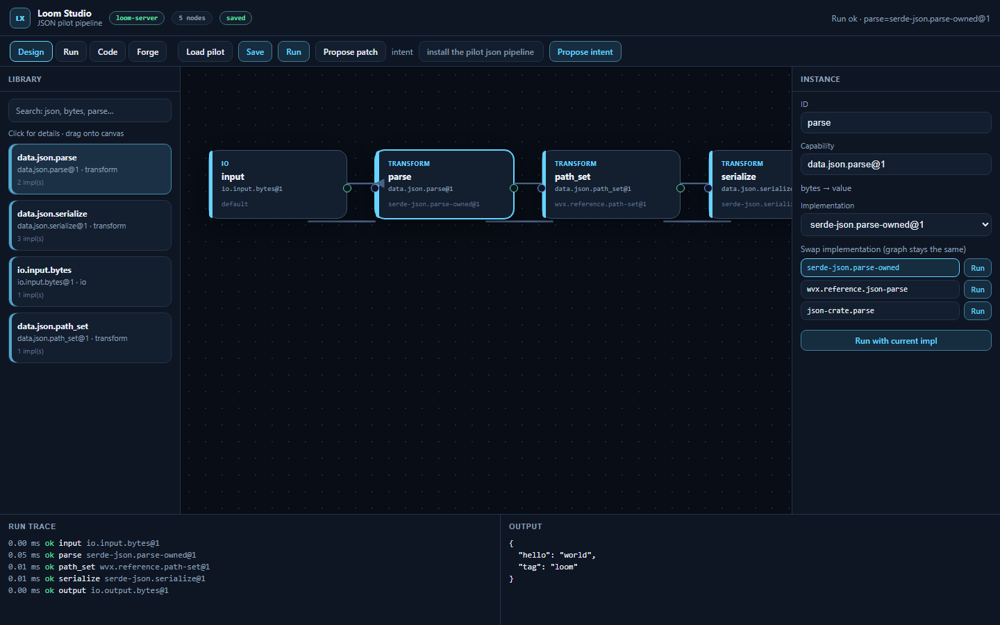

# Weavatrix Loom

**Compose systems from verified capabilities. Get ordinary Rust.**

Weavatrix Loom is a **visual semantic compiler** and registry for proven Rust
components. You work with formal *capabilities* (parse JSON, hash with BLAKE3,
compress with Gzip) rather than raw crates and free-form prompts. Each capability
can have one or more Rust implementations that share a contract, tests, and
measured characteristics. Loom turns a typed graph of those capabilities into a
normal, readable Rust workspace.

> **Status:** public **v0.1 pilot** (JSON transform vertical). Core libs, CLI, MCP,
> HTTP server, conformance/golden (Gates A/D), Forge static inventory, and Cortex
> intent→GraphPatch live in this repo. The visual UI is the sibling
> **[loom-studio](https://github.com/sergii-ziborov/loom-studio)**.

## Studio preview



*Design canvas: library + typed graph, multi-impl swap with per-impl Run, run trace,
and optional intent → GraphPatch. UI lives in [loom-studio](https://github.com/sergii-ziborov/loom-studio).*

## Why

The next abstraction is not prettier blocks or more LLM code generation. It
appears when four things are true at once:

1. **Capability is separate from implementation**
2. **Implementations are swappable** without rewriting the semantic graph
3. **Compatibility and behavior are checked**, not only documented
4. **Humans and AI edit the same structural model** (not free-form file edits)

## Core ideas

| Concept | Meaning |
| --- | --- |
| **Capability** | What must be done (stable contract, ports, errors) |
| **Implementation** | Which Rust code fulfills that contract |
| **Instance** | A capability placed in a project with config |
| **Binding** | A validated connection between typed ports |
| **Evidence** | Why an implementation can be trusted (build, conformance, benchmarks, policy) |
| **WVX** | The project / IR format (`.wvx`) |

Boundary types in `0.1` are owned and canonical (`string`, `bytes`,
`json.value`, lists, options, records, …). Upstream crates may use any Rust
types internally; adapters normalize them at the component boundary.

## Schemas & decisions

| Path | What |
| --- | --- |
| [`schemas/`](schemas/) | JSON Schema for project, capability, GraphPatch (`wvx.project.v0.1`, …) |
| [`docs/adr/`](docs/adr/) | Architecture Decision Records (Rust-first, GraphPatch, export, …) |
| [`docs/go-no-go-a-d-pilot-json.md`](docs/go-no-go-a-d-pilot-json.md) | Gate A/D evidence on the JSON pilot |

Rust IR types remain authoritative if schema and code diverge.

## Workspace

This repository is a **Rust library platform** plus thin hosts. The visual
Studio UI lives in a separate repository and talks to the same command surface.

| Crate | Role |
| --- | --- |
| `wvx-types` | Canonical boundary types |
| `wvx-ir` | WVX entities (capability, implementation, instance, binding, project) |
| `wvx-project-graph` | Project graph operations + GraphPatch apply |
| `wvx-validator` | Structural and type validation |
| `wvx-runtime` | Dynamic playground execution (erased values) |
| `wvx-compiler-rust` | Export a validated graph to a native Rust workspace |
| `wvx-registry-client` | Read a local capability registry |
| `wvx-command-bus` | Shared semantic API for CLI, MCP, and HTTP |
| `wvx-cli` | Command-line entry point |
| `wvx-mcp` | Bounded MCP tools over the command bus ([`mcport`](https://crates.io/crates/mcport)) |
| `wvx-adapters` | Pilot JSON implementations (parse / serialize / path_set) |
| `wvx-forge` | Static crate inventory + public API extract |
| `wvx-conformance` | Capability vectors + golden (dynamic ≡ export) |
| `wvx-cortex` | Intent → GraphPatch (heuristics + optional xAI LLM; ops only) |
| `loom-server` | Local HTTP API for Studio (`127.0.0.1:43917`) |

## CI

GitHub Actions (`.github/workflows/ci.yml`) on push/PR to `main`:

1. `cargo check --workspace` + `cargo test --workspace`
2. **Gates A/D:** `wvx conformance` + `cargo test -p wvx-conformance` (includes golden export)
3. Smoke run with `json-crate.parse@1`
4. Presence checks for schemas / ADRs / pilot fixture

## Quick start

```bash
cargo check --workspace
cargo run -p wvx-cli -- --help
```

Validate and run the JSON pilot fixture:

```bash
cargo run -p wvx-cli -- validate fixtures/pilot-json-pipeline.wvx.json
cargo run -p wvx-cli -- run fixtures/pilot-json-pipeline.wvx.json
cargo run -p wvx-cli -- implementations
```

Swap an implementation **without** changing the capability graph or bindings:

```bash
# default: serde-json parse + serialize
cargo run -p wvx-cli -- run fixtures/pilot-json-pipeline.wvx.json

# alternate parse (lite recursive-descent) + pretty serialize
cargo run -p wvx-cli -- run fixtures/pilot-json-pipeline.wvx.json \
  --impl parse=wvx.reference.json-parse@1 \
  --impl serialize=wvx.reference.json-serialize-pretty@1

# third parse backend (json crate)
cargo run -p wvx-cli -- run fixtures/pilot-json-pipeline.wvx.json \
  --impl parse=json-crate.parse@1
```

`run` uses built-in pilot playground handlers. Trace lines report which
implementation executed per instance.

Export a native Rust package (adapters inlined, `cargo check` / run):

```bash
cargo run -p wvx-cli -- export-rust fixtures/pilot-json-pipeline.wvx.json \
  -o /tmp/loom-export --check --run
```

The export is a normal Cargo package with `run_pipeline(&[u8]) -> Result<Vec<u8>, String>`.

## Local registry (`registry-dev`)

Pilot capability contracts and implementation manifests live in
[`registry-dev/`](registry-dev/). Query them with:

```bash
cargo run -p wvx-cli -- registry summary
cargo run -p wvx-cli -- registry search json
cargo run -p wvx-cli -- registry implementations --capability data.json.parse@1
cargo run -p wvx-cli -- registry inspect serde-json.parse-owned@1
```

Override the path with `--path` or `WVX_REGISTRY`.

## HTTP server

```bash
cargo run -p loom-server
# http://127.0.0.1:43917/health
# WVX_HTTP_ADDR=127.0.0.1:44000 WVX_REGISTRY=./registry-dev cargo run -p loom-server
```

| Method | Path | Notes |
| --- | --- | --- |
| GET | `/health` | liveness |
| GET | `/api/v1/protocol` | protocol version |
| POST | `/api/v1/project/validate` | body: `{ "project": … }` |
| POST | `/api/v1/project/run` | body: `{ "project", "input_json"?, "impls"? }` |
| POST | `/api/v1/project/export-rust` | in-memory generated package |
| GET | `/api/v1/registry/summary` | |
| GET | `/api/v1/registry/search?q=` | |
| GET | `/api/v1/registry/implementations?capability=` | |
| GET | `/api/v1/registry/inspect/{key}` | |
| GET | `/api/v1/pilot/implementations` | playground handler catalog |
| POST | `/api/v1/forge/inventory` | body `{ "path": "<crate-or-workspace>" }` static scan |
| POST | `/api/v1/forge/extract` | public API candidates from `src/` |
| POST | `/api/v1/graph/propose_patch` | body `{ project? }` — relative pilot GraphPatch |
| POST | `/api/v1/graph/propose_intent` | body `{ project, intent }` — heuristic or LLM (ops only) |
| POST | `/api/v1/graph/apply_patch` | body `{ project, patch }` |

### Forge (static inventory)

```bash
cargo run -p wvx-cli -- forge inventory .
```

Reads `Cargo.toml` / tree indicators only — no `build.rs`, no network.

CORS is open for local Studio development. Bind stays loopback by default.

### External adapters

Pilot JSON implementations live in the **`wvx-adapters`** crate. Exports vendor
that crate under `vendor/wvx-adapters` so generated projects stay self-contained
while the monorepo keeps a single source of truth.

## Loom Studio (separate repo)

The visual editor lives in **[loom-studio](https://github.com/sergii-ziborov/loom-studio)**
(not this crate). Run the server here, then:

```bash
cd ../loom-studio
npm install
npm run dev
# http://127.0.0.1:5173  (Vite proxies /api and /health → loom-server)
```

## Conformance & golden (pilot)

```bash
# Capability vectors: all pilot parse/serialize/path_set impls
cargo run -p wvx-cli -- conformance

# Plus dynamic playground ≡ static export (invokes cargo for each combo)
cargo run -p wvx-cli -- conformance --golden

# Or as unit tests
cargo test -p wvx-conformance
```

Go/No-Go evidence for Gates **A** (interchangeability) and **D** (dynamic≡static) is recorded in
[`docs/go-no-go-a-d-pilot-json.md`](docs/go-no-go-a-d-pilot-json.md)
(**A: Go parse** — 3 parse backends incl. `json-crate.parse@1`; **D: Go pilot** as of 2026-08-12).

### Intent → GraphPatch (Cortex)

**Most of Loom works with zero cloud keys.** Run, validate, export, registry, Forge
inventory, and rule-based / heuristic GraphPatch are fully offline.

Optional LLM propose (free-form English → ops-only GraphPatch) uses **xAI**
(SpaceXAI-compatible API) when the **server** has:

| Env | Required? | Purpose |
| --- | --- | --- |
| `XAI_API_KEY` | only for LLM intents | Server-side chat completions at `https://api.x.ai/v1` |
| `WVX_LLM_MODEL` | no (default model) | Override chat model |
| `XAI_BASE_URL` | no | Override API base |

Create a key at [console.x.ai](https://console.x.ai). **Never commit the key** and
**never put it in the Studio frontend** — only `loom-server` / CLI process env.

```bash
# Offline heuristics (no API key):
cargo run -p wvx-cli -- patch intent "install the pilot json pipeline"
cargo run -p wvx-cli -- patch intent "use pretty serialize" --project fixtures/pilot-json-pipeline.wvx.json
cargo run -p wvx-cli -- patch intent "switch parse to json-crate" --project fixtures/pilot-json-pipeline.wvx.json

# Optional LLM (Windows PowerShell example):
# $env:XAI_API_KEY = "xai-..."
# cargo run -p wvx-cli -- patch intent "add a pretty serialize step if missing" --project fixtures/pilot-json-pipeline.wvx.json
```

Studio: toolbar **intent** + **Propose intent** → Accept/Reject (ghost banner). Without
`XAI_API_KEY` on the server, known phrases still work via heuristics.

## Related repositories

| Repo | Role |
| --- | --- |
| **[weavatrix-loom](https://github.com/sergii-ziborov/weavatrix-loom)** (this) | Rust platform, CLI, MCP, HTTP, registry-dev, docs |
| **[loom-studio](https://github.com/sergii-ziborov/loom-studio)** | TypeScript / React Studio UI |

## Pilot scope (`0.1`)

The first vertical slice is a pure data-transform pipeline:

```text
Input Bytes → JSON Parse → JSON Path Set → JSON Serialize → Output Bytes
```

Goals for this series:

- typed ports and validated bindings
- more than one implementation for JSON parse / serialize
- playground run with a trace
- export to a `cargo`-buildable workspace whose results match the playground
- CLI and MCP over one command bus (no free-form AI file edits)

Out of scope for `0.1`: multi-language implementations, required WASM, databases
and queues, distributed transactions, autonomous production swaps, and a full
UI builder.

## Design principles

- **Rust is the production output.** Generated code should be readable and
  maintainable outside Loom.
- **One command bus.** Studio, CLI, and MCP share the same operations; the UI is
  not a second backend.
- **Evidence is multi-fact.** Build, conformance, benchmarks, license, and
  advisories stay separate — there is no single “readiness 82%” score.
- **Fail closed on structure.** Bindings exist only after validation.
- **Transport-independent core.** Libraries do not depend on HTTP or the editor.

## Related projects

- [Weavatrix](https://github.com/sergii-ziborov/weavatrix) — repository intelligence for coding agents
- [mcport](https://crates.io/crates/mcport) — MCP stdio runtime used by `wvx-mcp`
- [blazingly-json](https://crates.io/crates/blazingly-json) — JSON engine used across the Weavatrix stack

## License

Licensed under either of

- Apache License, Version 2.0 ([LICENSE-APACHE](LICENSE-APACHE))
- MIT license ([LICENSE-MIT](LICENSE-MIT))

at your option.
